# pdbr

[](https://pypi.org/project/pdbr/) [](https://pypi.org/project/pdbr/) [](https://github.com/cansarigol/pdbr/actions?query=workflow%3ATest) [](https://results.pre-commit.ci/latest/github/cansarigol/pdbr/master)

`pdbr` is intended to make the PDB results more colorful. it uses [Rich](https://github.com/willmcgugan/rich) library to carry out that.

## Table of contents

- [Installing](#installing)
- [Breakpoint](#breakpoint)
  - [What `import pdbr` does at load time](#what-import-pdbr-does-at-load-time)
- [New commands](#new-commands)
  - [inspect / inspectall / ia](#inspect--inspectall--ia)
  - [search / src](#search--src)
  - [sql](#sql)
  - [syntax / syn](#syntax)
  - [vars / v](#vars)
  - [varstree / vt](#varstree--vt)
  - [log](#log)
  - [whereami](#whereami)
  - [diff](#diff)
- [Config](#config)
  - [Style](#style)
  - [History](#history)
  - [Context](#context)
- [Celery](#celery)
  - [Telnet](#telnet)
- [IPython](#ipython)
- [pytest](#pytest)
- [sys.excepthook](#sysexcepthook)
- [Context Decorator](#context-decorator)
- [Django DiscoverRunner](#django-discoverrunner)
- [Middlewares](#middlewares)
- [Shell](#shell)
- [Vscode user snippet](#vscode-user-snippet)
- [Samples](#samples)

## Installing

Install with `pip` or your favorite PyPi package manager.

```
pip install pdbr
```

## Breakpoint

In order to use ```breakpoint()```, set **PYTHONBREAKPOINT** with "pdbr.set_trace"

```python
import os

os.environ["PYTHONBREAKPOINT"] = "pdbr.set_trace"
```

or just import pdbr

```python
import pdbr
```

### What `import pdbr` does at load time

Importing `pdbr` is not free — it walks `setup.cfg` (local cwd, then
`$XDG_CONFIG_HOME/pdbr/setup.cfg`) and performs three side effects:

1. Sets `PYTHONBREAKPOINT` to `pdbr.set_trace` so plain `breakpoint()`
   drops into pdbr.
2. Installs Rich's traceback handler globally (`sys.excepthook`) unless
   `[pdbr] use_traceback = False`.
3. Attaches a `RingHandler` to the **root logger** to feed the `log`
   command's buffer. Its level defaults to `WARNING`, chosen so that
   `import pdbr` does not raise root's effective level and change what
   every other handler on the tree sees. If you set `[pdbr.log] level`
   to `INFO` or `DEBUG` to capture more, be aware that root gets lifted
   to that level too, so all handlers on root (console, Sentry,
   CloudWatch, etc.) will start seeing those records as well.

To opt out of the log ring buffer entirely, set `[pdbr.log] enabled =
False` in your `setup.cfg`.

## New commands
### (i)nspect / inspectall | ia
[rich.inspect](https://rich.readthedocs.io/en/latest/introduction.html?s=03#rich-inspector)-powered
introspection of any expression: attributes, method signatures and docstrings in one panel.
`inspectall` / `ia` widens the output to include private and dunder members.

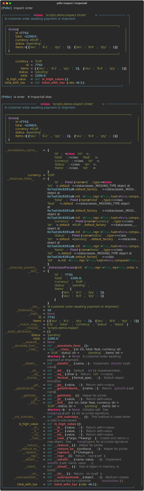

### search | src
Search a phrase in the current frame. `pdbr` jumps to the next matching line and repositions
the source view. In order to repeat the last one, type **/** character as arg.

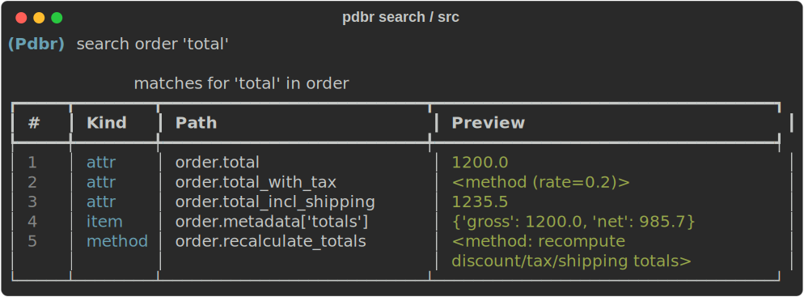

### sql
Display value in sql format. Don't forget to install [sqlparse](https://github.com/andialbrecht/sqlparse) package.

It can be used for Django model queries as follows.

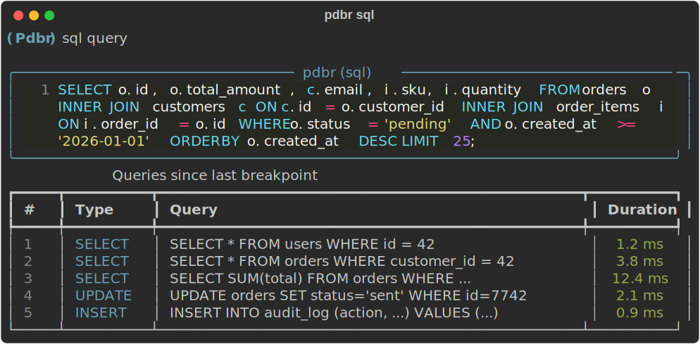

### (syn)tax
`syn <val>, <lexer>` — evaluates both in the current frame and pipes the value
through the specified [Pygments lexer](https://pygments.org/docs/lexers/) for
syntax-highlighted output (JSON payloads, HTML templates, YAML, etc.).

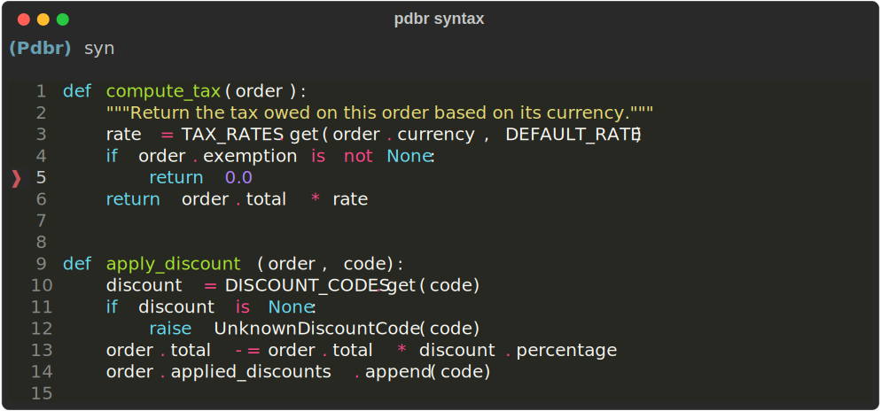

### (v)ars
Get the local variables list as table.
### varstree | vt
Get the local variables list as tree.

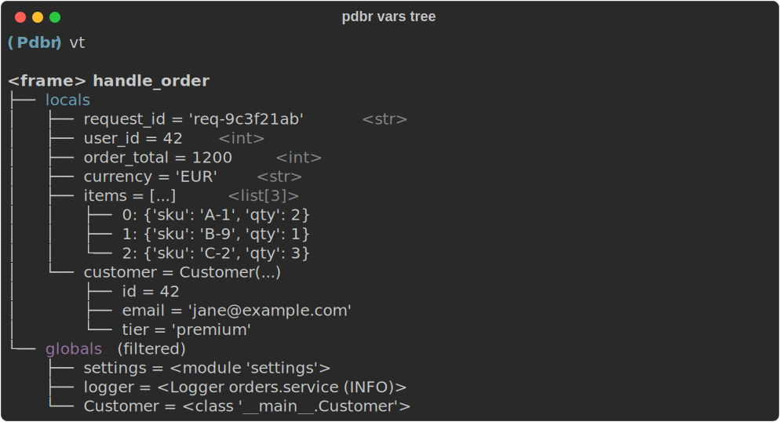

### log
Show recently captured log records as a Rich table.

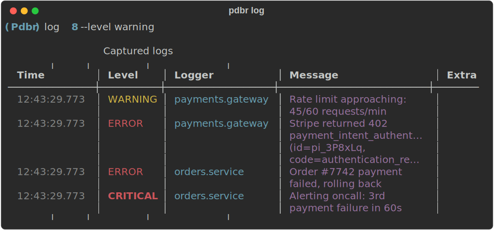

`pdbr` auto-installs a stdlib `logging` handler that captures every log
record into a bounded ring buffer. At a breakpoint, `log` renders them so
you can inspect what happened right before the debugger paused. Because
`structlog` (with the stdlib bridge) and any library that logs via stdlib
already flow through this handler, they are captured for free — event
dict fields land in the `Extra` column.

Usage:
```
(Pdbr) log                     # last 20
(Pdbr) log 50
(Pdbr) log --level warning
(Pdbr) log --contains timeout
(Pdbr) log --logger celery
(Pdbr) log clear
```

Configuration (all keys optional):
```
[pdbr.log]
enabled = True
buffer_size = 500
level = DEBUG
```

`enabled = False` disables the handler completely. `install_log_capture`,
`uninstall_log_capture` and `get_log_buffer` are also exposed as top-level
`pdbr` API for manual control.

#### IPython integration

When `pdbr` is imported inside an IPython session, `%log` is registered as
a line magic so it works outside a breakpoint too — e.g. a Django shell or a
Jupyter cell:

```
In [1]: import pdbr
In [2]: import my_app; my_app.do_stuff()
In [3]: %log --level warning
```

Both `%log` at the IPython prompt and `log` at the `(Pdbr)` prompt store the
filtered records under `_last_log` in the IPython namespace, so you can dig
in further:

```
In [4]: _last_log[-1].extra
Out[4]: {'task_id': 'abc123', 'retries': 2}
```

For manual bootstrapping (e.g. when `pdbr` is imported before the IPython
shell starts), call `pdbr.register_pdbr_ipython_magics()` explicitly, or
use `%load_ext pdbr`.

### whereami
One-shot snapshot of the runtime, process, frame, and any auto-detected
framework context. Useful when you drop into a breakpoint and want to
answer "where am I, in which env, under which request/task, with what
observability context?" without hand-crafting `print` statements.

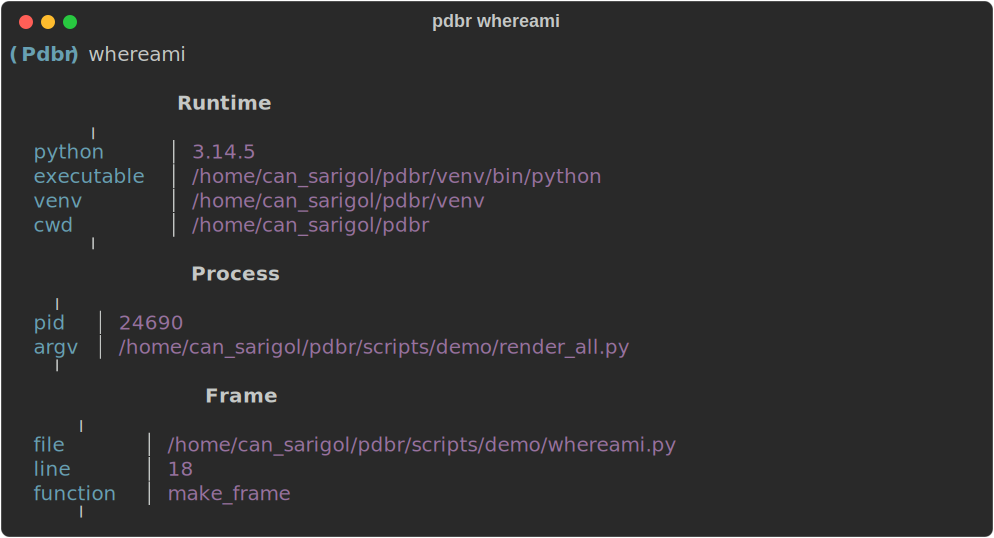

```
(Pdbr) whereami
```

Always-on sections:

- **Runtime** — Python version, executable, active venv, cwd.
- **Process** — pid and truncated `sys.argv`.
- **Frame** — file, line, function/method of the current frame.

Auto-detected sections (hidden when the framework is not imported or is
inactive):

- **Django** — `DJANGO_SETTINGS_MODULE`, `settings.DEBUG`, current DB
  alias, `in_atomic_block`, plus the closest `request` in the call stack
  (method/path/user).
- **Celery** — current task name and id (when called from within a task).
- **OpenTelemetry** — active `trace_id` / `span_id` (hex).
- **Structlog context** — bound `contextvars` (user_id, tenant, etc.).

Each optional section fails independently, so a broken integration never
prevents the others from rendering.

#### IPython integration

`%whereami` is registered as a line magic in the same way as `%log`:

```
In [1]: import pdbr
In [2]: %whereami
```

The last snapshot is stored under `_last_whereami` in the IPython
namespace as a plain dict, so it is easy to forward to Sentry, dump to
JSON, or diff between two calls:

```
In [3]: _last_whereami["django"]["request"]
Out[3]: {'method': 'POST', 'path': '/invoices/', 'user': 'alice@…'}
```

`collect_context()` and `render_whereami()` are also exposed as top-level
`pdbr` API for programmatic use.

### diff
Semantic diff of two expressions, rendered as a Rich table. Fills the gap
between `pprint(a); pprint(b) + eyeball` and pulling in `deepdiff` for
one-off comparisons at a breakpoint.

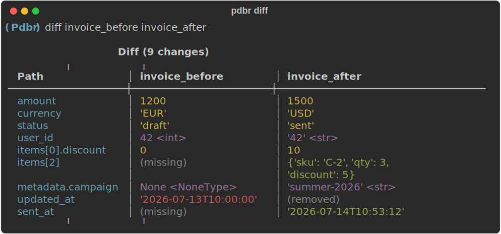

```
(Pdbr) diff invoice_before invoice_after
(Pdbr) diff request.headers dict(request.META)
(Pdbr) diff foo(1, 2) bar[0]      # parens / brackets are respected
```

Normalization is opt-in and framework-aware:

- `dict`, `list`/`tuple`, `set`, and primitives → compared structurally
- `dataclass` / `typing.NamedTuple` → field-level
- Django `Model` → per-field via `_meta.fields`; ForeignKey fields report
  the raw `_id` value to avoid lazy queryset explosions
- Pydantic v1 / v2 → `.dict()` / `.model_dump()`
- `attrs` → `attr.asdict(recurse=False)` so the walker keeps type info
- Any other object → `vars(obj)` fallback
- Cyclic references and >8-level depth are guarded

Type changes are called out separately from value changes (e.g. `'EUR'
<str>` → `Currency.EUR <Currency>`), so accidental serialization changes
don't hide behind matching reprs.

#### IPython integration

```
In [1]: %diff invoice_before invoice_after
In [2]: _last_diff             # the list of DiffEntry namedtuples
```

`compute_diff()` and `render_diff()` are also exposed as top-level `pdbr`
API — handy for logging structural diffs to Sentry or asserting against
them in tests.

## Config
Config is specified in **setup.cfg** and can be local or global. Local config (current working directory) has precedence over global (default) one. Global config must be located at `$XDG_CONFIG_HOME/pdbr/setup.cfg`.

### Style
In order to use Rich's traceback, style, and theme:

```
[pdbr]
style = yellow
use_traceback = True
traceback_show_locals = False
theme = friendly
```

`use_traceback` defaults to `True` — when the `[pdbr]` section is present,
Rich's traceback is installed unless you set `use_traceback = False`. Set
`traceback_show_locals = True` to dump every frame's local variables
alongside the traceback. This is a huge time-saver during development
(most bugs become obvious the moment you see the locals at the crash
site), but should stay `False` in any environment where the traceback
can leak to logs — `show_locals` prints tokens, PII, and secrets that
happen to be in scope.

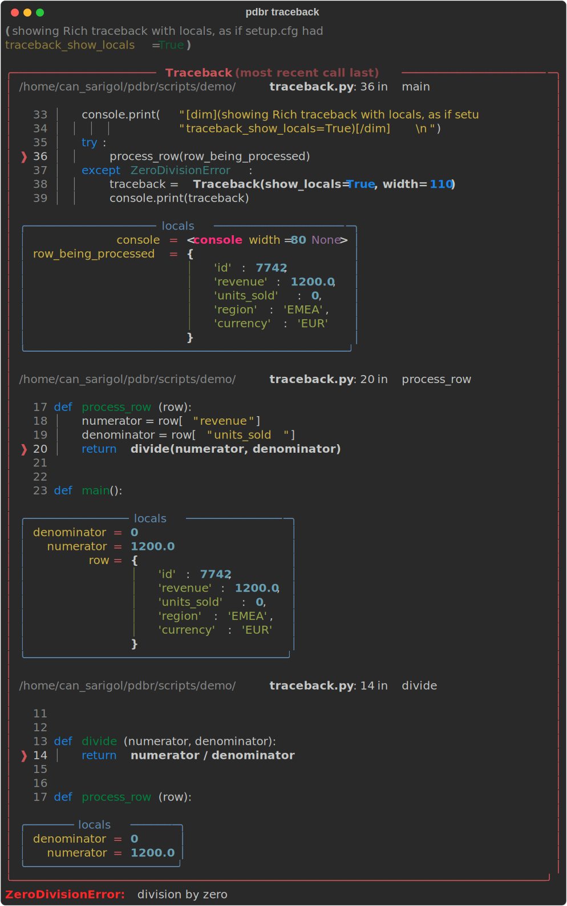

Also custom `Console` object can be assigned to the `set_trace`.
```python
import pdbr

from rich.console import Console
from rich.style import Style
from rich.theme import Theme

custom_theme = Theme({
    "info": "dim cyan",
    "warning": "magenta",
    "danger": "bold red",
})
custom_style = Style(
    color="magenta",
    bgcolor="yellow",
    italic=True,
)
console = Console(theme=custom_theme, style=custom_style)

pdbr.set_trace(console=console)
```
### History
**store_history** setting is used to keep and reload history, even the prompt is closed and opened again:
```
[pdbr]
...
store_history=.pdbr_history
```

By default, history is stored globally in `~/.pdbr_history`.

### Context
The **context** setting is used to specify the number of lines of source code context to show when displaying stacktrace information.
```
[pdbr]
...
context=10
```
This setting is only available when using `pdbr` with `IPython`.

## Celery
In order to use **Celery** remote debugger with pdbr, use ```celery_set_trace``` as below sample. For more information see the [Celery user guide](https://docs.celeryproject.org/en/stable/userguide/debugging.html).

```python
from celery import Celery

app = Celery('tasks', broker='pyamqp://guest@localhost//')

@app.task
def add(x, y):

    import pdbr; pdbr.celery_set_trace()

    return x + y

```
#### Telnet
Instead of using `telnet` or `nc`, in terms of using pdbr style, `pdbr_telnet` command can be used.

```
$ pdbr_telnet localhost 6899
Connected to Celery worker.
(Pdbr) w
> /worker/tasks.py(87)send_invoice_email()
(Pdbr) p invoice.amount
Decimal('1500.00')
(Pdbr) inspect invoice
... rich panel of attributes and methods ...
(Pdbr) c
```

Also in order to activate history and be able to use arrow keys, install and use [rlwrap](https://github.com/hanslub42/rlwrap) package.

```
rlwrap -H '~/.pdbr_history' pdbr_telnet localhost 6899
```

## IPython

`pdbr` integrates with [IPython](https://ipython.readthedocs.io/).

This makes [`%magics`](https://ipython.readthedocs.io/en/stable/interactive/magics.html) available, for example:

```python
(Pdbr) %timeit range(100)
104 ns ± 2.05 ns per loop (mean ± std. dev. of 7 runs, 10,000,000 loops each)
```

To enable `IPython` features, install it separately, or like below:

```
pip install pdbr[ipython]
```

## pytest
In order to use `pdbr` with pytest `--pdb` flag, add `addopts` setting in your pytest.ini.

```
[pytest]
addopts: --pdbcls=pdbr:RichPdb
```

## sys.excepthook
The `sys.excepthook` is a Python system hook that provides a way to customize the behavior when an unhandled exception occurs. Since `pdbr` use  automatic traceback handler feature of `rich`, formatting exception print is not necessary if `pdbr` module is already imported.

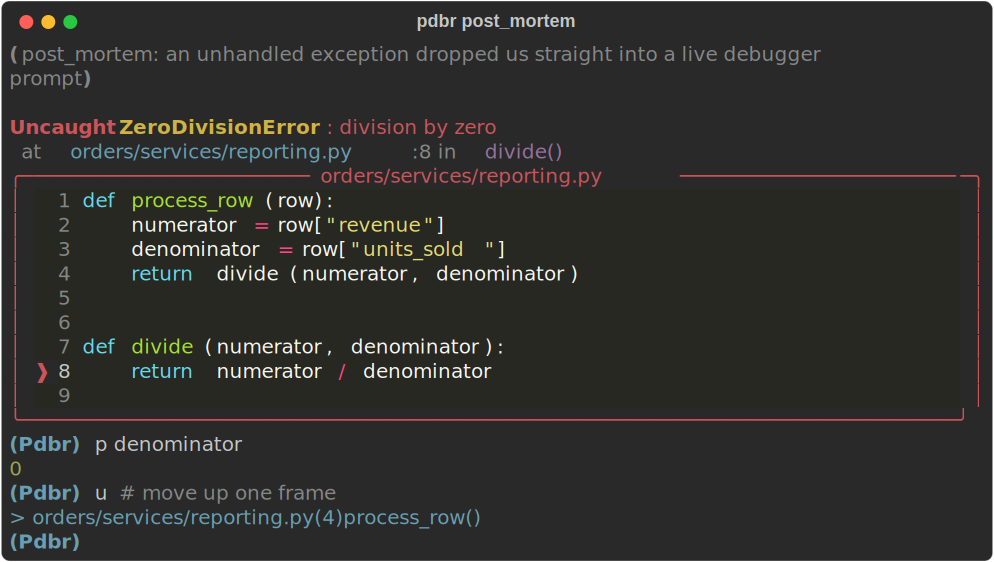

In order to use post-mortem or perform other debugging features of `pdbr`,  override `sys.excepthook` with a function that will act as your custom excepthook:
```python
import sys
import pdbr

def custom_excepthook(exc_type, exc_value, exc_traceback):
    pdbr.post_mortem(exc_traceback, exc_value)

    # [Optional] call the original excepthook as well
    sys.__excepthook__(exc_type, exc_value, exc_traceback)

sys.excepthook = custom_excepthook
```
Now, whenever an unhandled exception occurs, `pdbr` will be triggered, allowing you to debug the issue interactively.

## Context Decorator
`pdbr_context` and `apdbr_context` (`asyncio` corresponding) can be used as **with statement** or **decorator**. It calls `post_mortem` if `traceback` is not none.

```python
from pdbr import apdbr_context, pdbr_context

@pdbr_context()
def foo():
    ...

def bar():
    with pdbr_context():
        ...

@apdbr_context()
async def foo():
    ...

async def bar():
    async with apdbr_context():
        ...
```

## Django DiscoverRunner
To being activated the pdb in Django test, change `TEST_RUNNER` like below. Unlike Django (since you are not allowed to use for smaller versions than 3), pdbr runner can be used for version 1.8 and subsequent versions.

```
TEST_RUNNER = "pdbr.runner.PdbrDiscoverRunner"
```

Any test failure drops the runner into the same post-mortem experience shown above.
## Middlewares
### Starlette
```python
from fastapi import FastAPI
from pdbr.middlewares.starlette import PdbrMiddleware

app = FastAPI()

app.add_middleware(PdbrMiddleware, debug=True)

@app.get("/")
async def main():
    1 / 0
    return {"message": "Hello World"}
```
### Django
In order to catch the problematic codes with post mortem, place the middleware class.

```
MIDDLEWARE = (
    ...
    "pdbr.middlewares.django.PdbrMiddleware",
)
```

An unhandled exception during a request hands control to the same post-mortem prompt as `pdbr_context`.
## Shell
Running `pdbr` command in terminal starts an `IPython` terminal app instance. Unlike default `TerminalInteractiveShell`, the new shell uses pdbr as debugger class instead of `ipdb`.

#### %debug magic sample
After an exception in the IPython shell, `%debug` drops you into pdbr at the failing frame — same as `pdbr.pm()` but reachable directly from the shell:

```
In [1]: run my_script.py
---------------------------------------------------------------------------
ZeroDivisionError                         Traceback (most recent call last)
...
In [2]: %debug
> /myapp/services.py(23)calculate()
     22     total = sum(item.amount for item in items)
---> 23     return total / active_count
     24
(Pdbr) p active_count
0
(Pdbr) up
(Pdbr) whereami
... runtime + process + frame + Django context ...
```
### As a Script
If `pdbr` command is used with an argument, it is invoked as a script and [debugger-commands](https://docs.python.org/3/library/pdb.html#debugger-commands) can be used with it.
```python
# equivalent code: `python -m pdbr -c 'b 5' my_test.py`
pdbr -c 'b 5' my_test.py

>>> Breakpoint 1 at /my_test.py:5
> /my_test.py(3)<module>()
      1
      2
----> 3 def test():
      4         foo = "foo"
1     5         bar = "bar"

(Pdbr)

```
### Terminal
#### Django shell sample

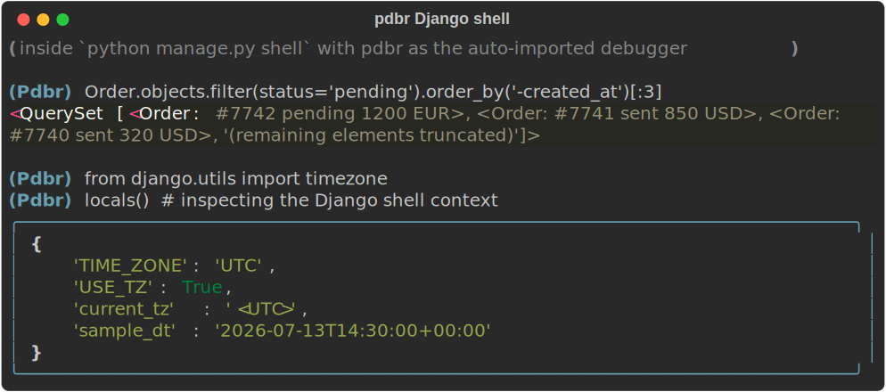

## Vscode user snippet

To create or edit your own snippets, select **User Snippets** under **File > Preferences** (**Code > Preferences** on macOS), and then select **python.json**.

Place the below snippet in json file for **pdbr**.

```
{
  ...
  "pdbr": {
        "prefix": "pdbr",
        "body": "import pdbr; pdbr.set_trace()",
        "description": "Code snippet for pdbr debug"
    },
}
```

For **Celery** debug.

```
{
  ...
  "rdbr": {
        "prefix": "rdbr",
        "body": "import pdbr; pdbr.celery_set_trace()",
        "description": "Code snippet for Celery pdbr debug"
    },
}
```

## Samples
Syntax-highlighted source listing, Rich pretty-printed objects and full
`inspect` output — the three commands that most obviously distinguish
`pdbr` from stock `pdb`:

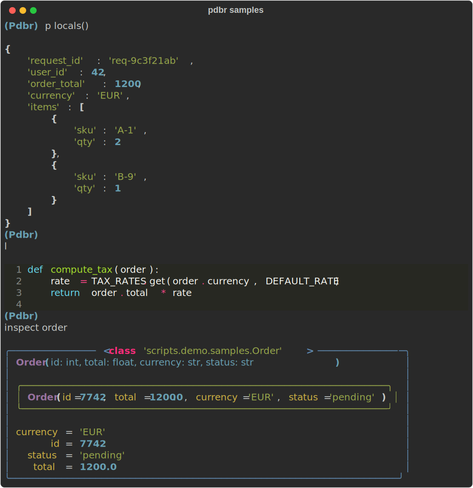

### Traceback
